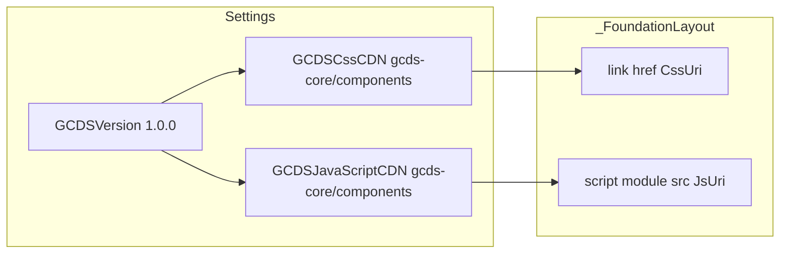

# GCDS stable v1.0.0 migration plan

## Reference

Follow the official breaking-change list in [Migrating from alpha to stable v1](https://github.com/cds-snc/gcds-components/blob/main/.docs/migration/stable-v1.md) (packages/paths + component API changes). Your codebase is on **0.43.1**, so the **0.39+ → 1.0.0** section applies.

## 1. CDN packages and default version

**File:** [`GCFoundation.Common/Settings/GCFoundationComponentsSettings.cs`](../GCFoundation.Common/Settings/GCFoundationComponentsSettings.cs)

- Change `GCDSCssCDN` and `GCDSJavaScriptCDN` URL templates from `@cdssnc/gcds-components` to **`@gcds-core/components`** (paths under `dist/gcds/` stay the same as in the migration doc).
- Set default **`GCDSVersion`** to **`1.0.0`** (or the exact patch you standardize on).
- **Verify on first run** that `https://cdn.design-system.alpha.canada.ca/@gcds-core/components@{version}/dist/gcds/gcds.css` (and `.esm.js`) resolve for your chosen version; if the stable line uses a different host or path, adjust the base URL once confirmed.
- **`GCDSCssShortcutsVersion`**: already uses `@gcds-core/css-shortcuts`; check [GCDS / css-shortcuts release compatibility](https://design-system.alpha.canada.ca/) or package release notes and bump if required so shortcuts stay aligned with components v1.

**CSP:** [`GCFoundation.Components/Configuration/GCFoundationComponentsCdnPolicyConfigurator.cs`](../GCFoundation.Components/Configuration/GCFoundationComponentsCdnPolicyConfigurator.cs) only adds **hosts** from those URIs, so no change is required unless the CDN host changes.

**Config:** [`GCFoundation.Web/appsettings.json`](../GCFoundation.Web/appsettings.json) does not override `GCDSVersion` today; after code defaults change, optionally set `FoundationComponentsSettings:GCDSVersion` explicitly for deployments.

**Optional (migration doc):** If you rely on GCDS-included base fonts, you may remove redundant Google Fonts `<link>` entries from `GlobalLinkTags` in appsettings to avoid duplicate loading—only after confirming typography in the browser.

## 2. Tag helpers in `GCFoundation.Components` (GCDS)

| Area | File(s) | Change (per stable-v1) |
|------|---------|-------------------------|
| Notice | [`NoticeTagHelper.cs`](../GCFoundation.Components/TagHelpers/GCDS/NoticeTagHelper.cs) | Emit **`notice-role`** instead of **`type`**. Keep existing `AlertType` / `Type` property in C# if you want, but map values to whatever strings v1’s `gcds-notice` expects (confirm against component docs; your code already lowercases enum names). Update XML docs. |
| Container | [`ContainerTagHelper.cs`](../GCFoundation.Components/TagHelpers/GCDS/ContainerTagHelper.cs) | Stop emitting **`centered`** / **`main-container`**. When `Centered` is true → **`alignment="center"`**. When `MainContainer` is true → **`layout="page"`** (and keep passing **`tag`** when set, e.g. `main`). Clarify in docs how `Size` interacts with `layout="page"` vs legacy `size="xl" main-container`. |
| Header | [`HeaderTagHelper.cs`](../GCFoundation.Components/TagHelpers/GCDS/HeaderTagHelper.cs) | Remove **`signature-variant`** from output. Deprecate or remove `SignatureVariant` from the public API, or keep the property but do not render it (to avoid invalid attributes). |
| Link | [`LinkTagHelper.cs`](../GCFoundation.Components/TagHelpers/GCDS/LinkTagHelper.cs) | Replace **`variant`** with **`link-role`**, mapping `LinkVariant` values to the v1 `link-role` tokens (confirm exact allowed values in v1 docs). |
| Top nav | [`TopNavigationTagHelper.cs`](../GCFoundation.Components/TagHelpers/GCDS/TopNavigationTagHelper.cs) + [`TopMenuAlignment.cs`](../GCFoundation.Components/Enums/TopMenuAlignment.cs) | Replace **`left`/`right`/`center`** with **`start`/`end`**. Remove **`center`** as a supported alignment (migration: center no longer supported—default is start-aligned). Default in code is currently `right` → use **`end`**. Any consumer using `center` must pick start or end. |
| Textarea | [`TextareaTagHelper.cs`](../GCFoundation.Components/TagHelpers/GCDS/TextareaTagHelper.cs) | Replace **`character-count`** with **`maxlength`**. Add optional **`hide-limit`** (bool) for “hide counter” behavior. Consider renaming the C# property to `MaxLength` for clarity (with backward-compatible obsolete alias if you want a softer break). |
| Card | [`CardTitleTag.cs`](../GCFoundation.Components/Enums/CardTitleTag.cs) + [`CardTagHelper.cs`](../GCFoundation.Components/TagHelpers/GCDS/CardTagHelper.cs) | Remove enum value **`a`**. In `Process`, **omit `card-title-tag`** when the effective value would imply the removed anchor behavior (v1 default handles the link title). |

**Not required by stable-v1 table (verify separately):** [`InputTagHelper.cs`](../GCFoundation.Components/TagHelpers/GCDS/InputTagHelper.cs) has no `placeholder`—good for the 0.39 removal. [`GridTagHelper.cs`](../GCFoundation.Components/TagHelpers/GCDS/GridTagHelper.cs) does not emit `centered`; no change unless you add passthrough later.

**Footer / removed components:** No `wordmark-variant`, `gcds-phase-banner`, or `gcds-verify-banner` usage was found.

## 3. Tag helpers in `TagHelpers/FDCP` (audit and generated markup)

Your instinct is right to include FDCP: those helpers render a lot of **`gcds-*`** HTML and share [`BaseTagHelper`](../GCFoundation.Components/TagHelpers/GCDS/BaseTagHelper.cs) from the GCDS folder. A pass over [`TagHelpers/FDCP`](../GCFoundation.Components/TagHelpers/FDCP) shows **no current use** of the main breaking APIs from the stable-v1 table (`gcds-notice` + `type`, `gcds-container` + `centered`/`main-container`, `gcds-top-nav` + legacy `alignment` values, `signature-variant`, `gcds-link` + `variant`, `character-count` on textarea, `card-title-tag="a"`).

**Do not confuse with GCDS:** [`FDCPModalTagHelper`](../GCFoundation.Components/TagHelpers/FDCP/FDCPModalTagHelper.cs) `Centered` only adds the **FDCP** class `fdcp-modal__dialog--centered`; it is unrelated to `gcds-container` `centered` and does **not** require a GCDS v1 API change.

**Still do this step:**

1. **Re-scan** every file under `TagHelpers/FDCP` after Step 2 (quick grep for `centered`, `main-container`, `character-count`, `gcds-notice`, `type=`, `variant`, `signature-variant`, `alignment=` on `gcds-top-nav`) so nothing new slips in.
2. **Generated strings:** [`FDCPFormBuilderTagHelper.cs`](../GCFoundation.Components/TagHelpers/FDCP/FDCPFormBuilderTagHelper.cs) builds `gcds-input`, `gcds-select`, `gcds-textarea`, `gcds-date-input`, `gcds-radios`, `gcds-checkboxes`, `gcds-error-summary`, `gcds-fieldset`, `gcds-button`, etc. Today its `gcds-textarea` block does **not** emit `character-count`; if you add a max-length feature for form questions, use v1’s **`maxlength`** and optional **`hide-limit`** (not `character-count`). Optionally wire **`[StringLength]`** / `FormQuestion` max length into `maxlength` for parity with the GCDS `TextareaTagHelper` behavior.
3. **Bare `gcds-link`:** [`FDCPStepperTagHelper.cs`](../GCFoundation.Components/TagHelpers/FDCP/FDCPStepperTagHelper.cs) emits minimal `<gcds-link href='...'>...</gcds-link>`. After Step 2, confirm in the browser or docs that no `link-role` is required for that default case; if v1 expects an explicit role in some themes, add the same mapping as `LinkTagHelper`.
4. **Other emitters:** [`FDCPPageHeadingTagHelper`](../GCFoundation.Components/TagHelpers/FDCP/FDCPPageHeadingTagHelper.cs) (`gcds-heading`, `gcds-text`), [`FDCPInputTagHelper`](../GCFoundation.Components/TagHelpers/FDCP/FDCPInputTagHelper.cs) / [`FDCPBaseFormComponentTagHelper`](../GCFoundation.Components/TagHelpers/FDCP/FDCPBaseFormComponentTagHelper.cs) (`gcds-input`, `gcds-textarea`, …), [`FDCPRichTextTagHelper`](../GCFoundation.Components/TagHelpers/FDCP/FDCPRichTextTagHelper.cs) (`gcds-hint`, `gcds-error-message`)—confirm against v1 docs for any renamed optional props (e.g. new `heading-role` on heading is additive, not a removal from the migration list).
5. **Tests:** If Step 2 or FDCP string changes alter rendered HTML (e.g. `gcds-link` gains `link-role`), update assertions in [`GCFoundation.Tests.Components`](../GCFoundation.Tests.Components) (e.g. [`FDCPStepperTagHelperTests.cs`](../GCFoundation.Tests.Components/Tests/TagHelpers/FDCP/FDCPStepperTagHelperTests.cs)).

## 4. Razor views, shared layouts, and embedded HTML in resources

Update raw markup to match v1 (tag helpers only fix markup that goes through them; much of your UI is plain `gcds-*` in `.cshtml` and `.resx`).

**Layouts / partials (high impact):**

- [`GCFoundation.Components/Views/Shared/_FoundationLayout.cshtml`](../GCFoundation.Components/Views/Shared/_FoundationLayout.cshtml): replace `size="xl" centered tag="main" main-container` with **`layout="page"`**, **`alignment="center"`**, **`tag="main"`** (drop `centered` / `main-container`; confirm whether `size="xl"` is still desired alongside `layout="page"` per current GCDS docs).
- [`GCFoundation.Components/Views/Shared/_BilingualErrorTemplate.cshtml`](../GCFoundation.Components/Views/Shared/_BilingualErrorTemplate.cshtml): same container pattern.
- [`GCFoundation.Components/Views/Shared/_PageNotification.cshtml`](../GCFoundation.Components/Views/Shared/_PageNotification.cshtml): `type` → **`notice-role`** on `gcds-notice`.

**Web views / samples:** replace `gcds-container` **`centered`** and **`gcds-notice` `type=`** everywhere under [`GCFoundation.Web/Views`](../GCFoundation.Web/Views) (e.g. `UserLogin.cshtml`, `UserLoginExample/Index.cshtml`, `StatelessAuthExample`, form samples, template demos, `Styles/Index.cshtml`, error demos).

**Menu:** [`GCFoundation.Web/Views/Shared/_menu.cshtml`](../GCFoundation.Web/Views/Shared/_menu.cshtml): `alignment="right"` → **`alignment="end"`**.

**Error views:** [`Global.cshtml`](../GCFoundation.Components/Views/Error/Global.cshtml), [`NotFound.cshtml`](../GCFoundation.Components/Views/Error/NotFound.cshtml): update notice attributes (`type` → `notice-role`; align `title` / `title-tag` with whatever v1 `gcds-notice` documents—many of your files mix `title` vs `notice-title`).

**Localized HTML strings:** Update snippets in [`GCFoundation.Web/Resources/Components.resx`](../GCFoundation.Web/Resources/Components.resx), `Components.fr.resx`, [`Template.resx`](../GCFoundation.Web/Resources/Template.resx), `Template.fr.resx`, and regenerate designers if your workflow requires it, so embedded `gcds-notice type=` examples match v1.

**Docs / installation strings:** Same for any `.resx` / `.Designer.cs` that embed `gcds-notice` or container patterns used as documentation.

## 5. `GCFoundation.Tests.Components`

- **Expectation:** Most tests target **FDCP** tag helpers; they should still pass if GCDS markup changes are limited to views and GCDS tag helpers.
- **GCDS-specific:** Only [`GridTagHelperTests.cs`](../GCFoundation.Tests.Components/Tests/TagHelpers/GCDS/GridTagHelperTests.cs) exists under `TagHelpers/GCDS`; it does not assert removed APIs—no change unless you extend coverage.
- **FDCP-specific:** Re-run tests after **Step 3**; adjust string assertions if FDCP-generated `gcds-*` markup changes (see Step 3, bullet on tests).
- **After code changes:** run `dotnet test` on [`GCFoundation.Tests.Components`](../GCFoundation.Tests.Components) and fix any failures (e.g. if FDCP helpers start emitting updated `gcds-link` attributes).

## 6. Verification checklist

1. **Build** solution.
2. **Run** `GCFoundation.Web`: confirm layout, header/footer, nav, notices, and sample pages render without console errors; confirm GCDS script loads (network 200, CSP happy).
3. **Spot-check** pages that heavily use GCDS: installation/components docs, User Login examples, template demos, Styles deprecation page.
4. **Full test** `GCFoundation.Tests.Components`.

## Risk notes

- **`notice-role` values** and **`link-role` values** must match v1 component schemas; if enum strings differ from GCDS (e.g. `Warning` vs `warning` vs another token), adjust mapping once verified in the official component documentation.
- **Top nav `center`:** if any view relied on center alignment, you must choose **start** or **end** per the migration rationale.
